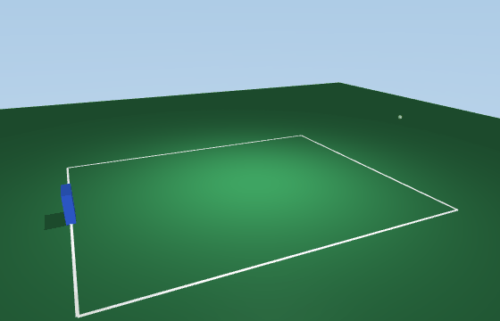
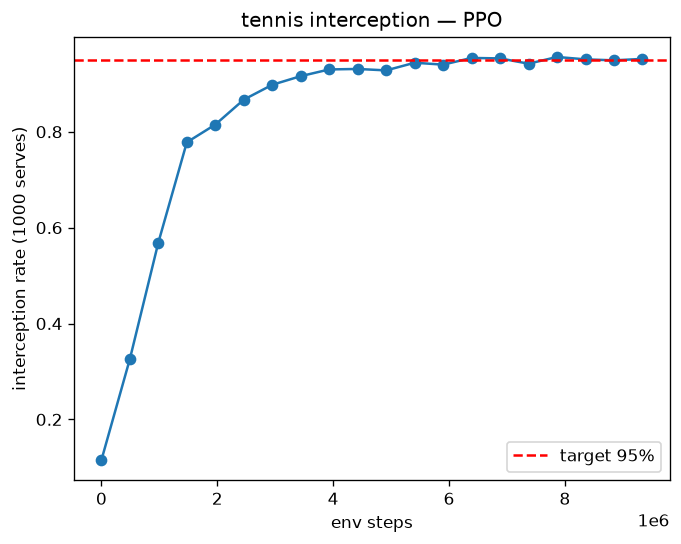
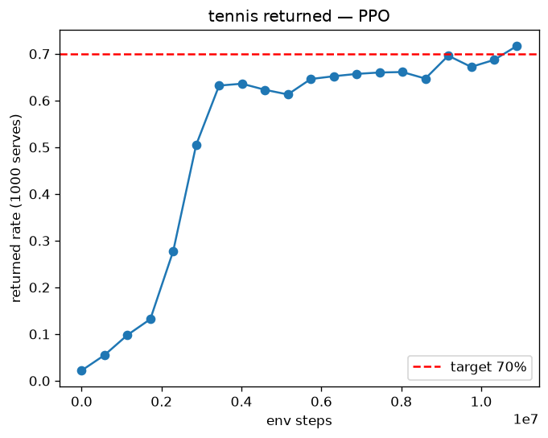

# brax-tennis-rl

Training a PPO agent in [Brax](https://github.com/google/brax) (Google's JAX
physics engine) to intercept and return a tennis ball. The paddle IS the
player: no humanoid, no articulated arm — a box that learns to slide, meet a
served ball, and put it back over the net.

Full design, phase gates, and kill-switch deliverables: [SPEC.md](SPEC.md).
Status: **Phase 1 complete — 95.2% interception over 1000 random serves**
(target ≥95%), trained with stock PPO in 9.3M env steps on a laptop CPU.

**Phase 2 complete — 71.7% of serves returned over the net into the far
court** (target ≥70%; final 1000-serve eval, recent evals 67–72%), stock PPO,
10.9M env steps, laptop CPU. It took six training runs and three recorded
reward hacks to get here — the debugging story is the writeup.

Reproduce either phase: `uv run python scripts/train_tennis.py [--phase2]`
(~20–90 min CPU). Re-render demos from a checkpoint without retraining:
`uv run python scripts/render_tennis.py out/phase2_params --phase2 --gif demo.gif`
(offscreen MuJoCo — no browser, no screen recording).

Backend: **MJX** — see [ADR 0002](docs/adr/0002-backend-choice.md) for the
bounce-fidelity evidence (and why `positional` was disqualified outright).
Phase 0 notebook: [`notebooks/phase0_ant.ipynb`](notebooks/phase0_ant.ipynb)

— stock PPO on `ant`: curve, checkpoint round-trip, rendered rollout.

- **Phase 0** — validate the stock training loop (PPO on `ant`, Colab)
- **Phase 1** — ball interception: ≥95% of random serves met
- **Phase 2** — the return: ≥70% of serves returned into the far court
- **Phase 3** (stretch) — rally self-play

Built inside the [personal agentic flywheel](https://github.com/jamesponwith/agentic-flywheel)
from [flywheel-template-py](https://github.com/jamesponwith/flywheel-template-py) —
spec-first, `bd` issue tracking, ruff+pytest gates, weekly public
[DORA metrics](https://jamesponwith.github.io/dora.html).

