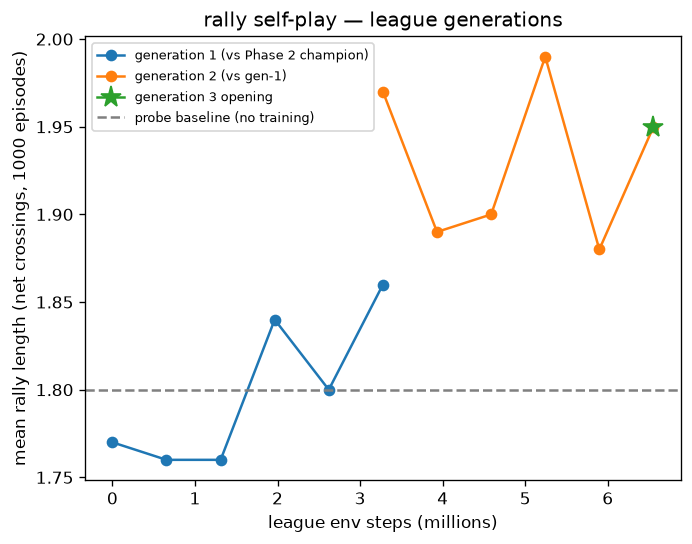

# Teaching an agent to play tennis in JAX — Part 3: the rally

> Target home: jamesponwith.github.io, closing the series.

Part 2 ended with a paddle that returns 71.7% of serves. Part 3 puts a
second paddle on the far baseline and asks the only question left: can two
of them keep a point alive?

Answer: yes, and each generation rallies longer than the last. But the best
bug of the whole project came first, and it beat every probe I had.

## The warm start that wouldn't

The plan was a curriculum: take the flat-face champion, surgically expand
its network for a tilt-hinge wrist — new observation rows and action column
initialized to zero, so step one plays identically — and fine-tune. The
surgery verified perfectly offline: 73% returns, champion-level.

Training evals: **0.4%.** Random-policy territory, from a 71.7% warm start.

The forensics chain, each layer verified before the next: the surgery was
correct (73% offline). The restore path was correct (params round-tripped
through the trainer still scored 75%). The evaluator was honest (a flat
control scored 69%). Per-step action distributions were *identical* between
deterministic and stochastic modes. And yet: deterministic eval 68%,
stochastic eval 0.4%.

The action trace ended the mystery. Under stochastic control, the paddle
was commanded at 6.4 m/s in x — and moved **ten centimeters in 1.2
seconds.** Jammed. The paddle box sat exactly flush on the court; the tilt
hinge's micro-pitch under jittery sampled actions dug its bottom edge into
the plane, and floor friction locked the slides. Deterministic motion is
smooth and never digs — which is why every deterministic probe sailed
through while sampling collapsed. The paddle's own physics was the
adversary.

The fix was two centimeters: float the box off the court. The warm start
immediately evaluated at 70.3%. That jam had been silently taxing every
phase of the project.

## The wrist buys aim, not consistency

With the physics honest, the tilt fine-tune ran clean — and produced my
favorite kind of result: a split decision. Return rate: 67.5%, *below* the
71.7% flat baseline. Episode reward: up two points. The wrist wasn't
returning more balls; it was placing the ones it returned closer to the
target. Aim, not consistency. The flat face stays the workhorse, and the
spec's "flat-through-lob control" line gets an honest asterisk.

## Two of me

Self-play needed no new network and no new tricks. The court is symmetric,
so one policy can play both ends: the far paddle is driven inside the env
by a frozen copy reading *mirrored* observations — y and vy negated, so the
opponent believes it is the near paddle. The learner keeps Part 2's exact
interface, which means the champion warm-starts with zero surgery. Rally
length rides the evaluator the same way interception did: the metric fires
only on net crossings, so the episode sum is the rally.

Probe before training, as always: two frozen champions already rally — 1.80
mean crossings, max 5, a returned return in 25 of 40 episodes.

Then the league: train against the champion, freeze the result, train
against *that*. Generation 1 grew rallies 1.77 → 1.86 in-round. Generation
2 opened at 1.97 against its stronger opponent — reproduced across two
independent runs — and held ~1.95. The spec's success bar for Phase 3 was
"average rally length grows over training." It grows, generation over
generation, with a plateau forming near two crossings — the sampled-league
upgrade is the documented next rung.

## What I'd tell past me, part 3

- Deterministic probes lie by omission. Anything that only fails under
  sampled actions — friction jams, resonances — is invisible to them.
  Validate with the noise you'll train with.
- Falsify in layers. Surgery, restore, evaluator, actions, physics: each
  cleared before suspecting the next. The bug was in the last place, but
  the chain made it a corner instead of a haystack.
- Warm starts must start warm. Check the step-zero eval against the
  baseline before burning a single training hour.

That closes the arc: a box that learned to be where the ball lands, then to
put it back, then to keep a point alive against itself. The collegiate
tennis player taught an agent to play — and the agent's best lessons were
the ones it tried to cheat on.

*Built inside a [personal agentic flywheel](https://github.com/jamesponwith/agentic-flywheel)
— every fix above landed as a gated PR with tests. The repo is
[jamesponwith/brax-tennis-rl](https://github.com/jamesponwith/brax-tennis-rl).*
